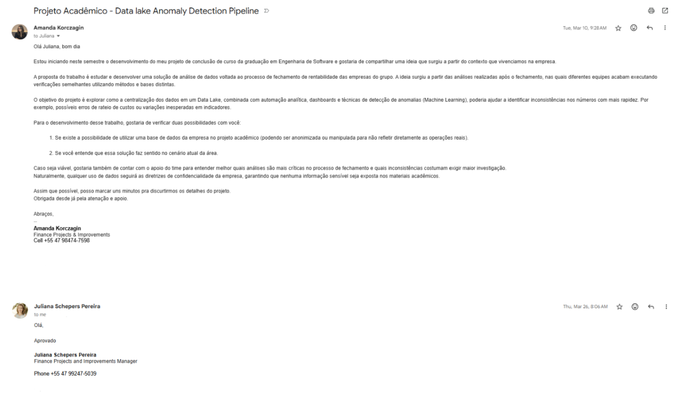
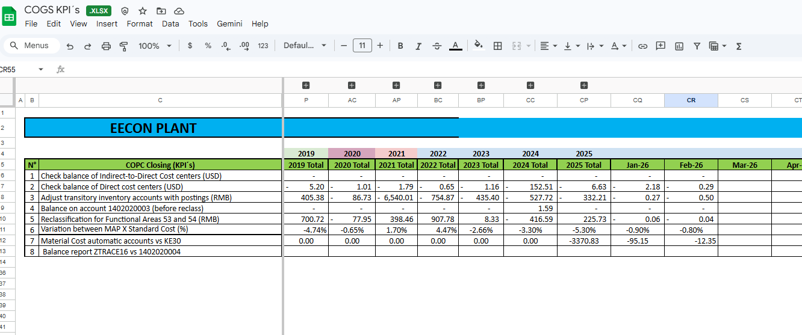
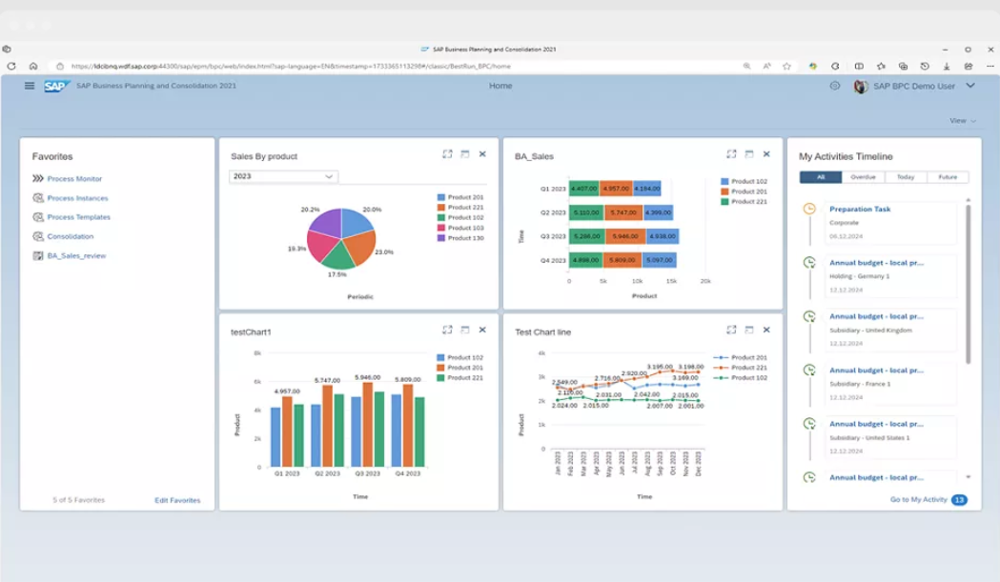

# RFC: Request for Comments - Projeto de Portifólio

## Identificação 
- **Título do Projeto:** Data Lake Anomaly Detection Pipeline  
- **Linha do Projeto:** Dados e IA (Machine Learning)  
- **Autor:** Amanda Korczagin  
- **Data da proposta:**  11/04/2026
- **Versão:** 1.4  

---

## 1. Visão de produto e impactos (O Problema)

### 1.1. Contexto e problema 

Em organizações que possuem múltiplas unidades de negócio ou empresas pertencentes a um mesmo grupo econômico, o processo de consolidação e análise de informações financeiras representa uma etapa crítica para a gestão corporativa, pois fornece suporte à tomada de decisão estratégica e ao controle gerencial (LAUDON, 2020). Após o fechamento contábil mensal, as equipes da área financeira realizam análises com o objetivo de validar os números consolidados, identificar possíveis inconsistências e garantir que os resultados divulgados representam corretamente a realidade operacional das empresas do grupo. 

Nesse contexto, as atividades relacionadas a validação dos resultados financeiros são realizadas pelos mais variados times de finanças, que frequentemente executam verificações semelhantes utilizando métodos, consultas e bases de dados distintas para chegar às mesmas conclusões. Atualmente, essas análises são realizadas por meio da extração de dados do sistema ERP, utilização de planilhas eletrônicas e validações visuais. Embora esses procedimentos tenham sido mantidos nos últimos anos como parte de uma rotina organizacional, ele apresenta forte dependência de atividades manuais e pouca padronização entre as análises realizadas pelos diferentes times.

Essa diversidade de origem e formato de dados aumenta o esforço operacional, possibilita o surgimento de divergências na interpretação dos dados e torna a análise mais complexa diante do grande volume de informações envolvidas, elevando também o risco de atrasos na identificação de inconsistências de caráter crítico. 

A validação da Margem de Contribuição é um dos pontos mais relevantes deste processo, dada sua importância para a análise de rentabilidade do grupo. Por evidenciar a capacidade de cada operação em cobrir custos fixos e gerar lucro (HORNGREN et al., 2012), este indicador exige precisão. Além disso, sob a perspectiva de dados, sua complexidade é elevada, uma vez que seu cálculo demanda a consolidação de um grande volume de transações operacionais provenientes de diferentes módulos do sistema ERP, envolvendo a correta classificação, agregação e associação entre receitas e custos variáveis ao longo do período analisado. 

O desafio reside no fato de que inconsistências em nível granular, como custos atípicos ou rateios incorretos, tendem a ser mascaradas na composição dos dados gerenciais, fazendo com que anomalias passem despercebidas até que sejam evidenciadas por análises manuais detalhadas. A identificação tardia desses erros interrompe o fluxo de fechamento de rentabilidade, exigindo o rastreamento manual entre milhões de registros e o reprocessamento das análises e relatórios contábeis, o que gera um retrabalho significativo e compromete o prazo de liberação dos resultados financeiros do grupo. 

Diante desse cenário, surge a necessidade de centralizar os dados transacionais em uma base integrada e automatizar a auditoria dos principais indicadores. A consolidação das informações em um _data lake_ permite processar grandes volumes de receitas e custos variáveis de forma estruturada e escalável, viabilizando análises mais rápidas e consistentes (KIMBALL; ROSS, 2013). Ainda, a aplicação da Análise Exploratória de Dados (AED) torna-se fundamental para compreender a distribuição das variáveis financeiras, identificar padrões sazonais e tratar de prévias inconsistências. Essa etapa, somada ao desenvolvimento de _dashboards_ gerenciais e algoritmos de _machine learning_ viabiliza a identificação precisa de anomalias e padrões atípicos, apoiando a tomada de decisão baseada em dados estrategicamente tratados (DAVENPORT, 2014). 

Assim, esse projeto propõe o desenvolvimento de um _pipeline_ de dados em nuvem voltado ao monitoramento da margem de contribuição, com o objetivo de reunir em um único ecossistema as as bases financeiras da organização e utilizar técnicas aplicadas de inteligência artificial para automatizar a detecção de anomalias, aumentando a precisão, agilidade e a confiabilidade do processo de fechamento financeiro do grupo. 

## 1.2. Origem da demanda e evidências 

A origem da demanda deste projeto está diretamente ligada ao contexto organizacional de uma empresa manufatureira multinacional do setor industrial, com atuação global e sede na cidade de Joinville. Em um levantamento inicial, foi realizada uma reunião com os principais _focal points_ das equipes envolvidas no fechamento contábil, com o objetivo de identificar e compreender os desafios mais críticos enfrentados ao longo das etapas de execução, conclusão e análise desse ciclo.

Após a discussão inicial em conjunto, foram conduzidas interações individuais com as áreas de negócio, durante as quais foi possível coletar percepções atuais mais precisas e detalhar as principais dificuldades técnicas enfrentadas pelos times, bem como os impactos que afetam negativamente o andamento das atividades. 

Diante da coleta dessas informações, e após uma rodada extensa e complementar de pesquisa, foi possível concluir que o desenvolvimento de uma solução baseada na centralização de dados e automação analítica permitirá facilitar o apoio à identificação de inconsistências nos dados financeiros de forma mais eficiente. A iniciativa foi submetida à validação da área responsável pela disponibilização de recursos para execução de projetos, a qual demonstrou concordância quanto à relevância da proposta e a viabilidade de desenvolvimento em contexto acadêmico, conforme formalizado na Figura 1.

**Figura 1** – Evidência da validação da proposta por meio de comunicação formal com a área responsável pela gestão de projetos financeiros.

**Fonte**: Gmail corporativo fornecido organização

### 1.2.1. Conformidade à políticas internas da organização. 

Durante o alinhamento com a área de gestão de projetos, também foi ressaltada a necessidade de garantir a confidencialidade das informações financeiras utilizadas na elaboração de relatório e desenvolvimento prático da solução proposta. Diante dessa diretriz, foi estabelecido que qualquer citação de dados reais deverá seguir rigorosamente as políticas de segurança e governança da organização, incluindo a anonimização ou mascaramento dos parâmetros sensíveis.

Nesse contexto, o projeto foi estruturado de modo a não expor registros confidenciais, assegurando que os materiais acadêmicos não contenham informações que possam comprometer a integridade ou a privacidade dos dados corporativos, mantendo a conformidade com as políticas internas da empresa. 

## 1.3. Análise de Soluções Existentes (_Benchmark_)

### 1.3.1. Apresentação das Ferramentas

Para validar a viabilidade e a necessidade do desenvolvimento do _pipeline_ de dados customizado, foram analisadas as principais alternativas tecnológicas e metodológicas disponíveis atualmente para o processo de fechamento e detecção de inconsistências:

### 1.3.1.1. Ferramentas de planilhas eletrônicas

**Nome da solução**: Microsoft Excel / Google Sheets  
**Link**: https://www.microsoft.com/excel e https://www.google.com/sheets  
**Público-alvo**: Analistas financeiros, contadores, entre outros.  
**Principais funcionalidades**:
 - Manipulação de dados;
 - Aplicação de fórmulas e demais cálculos financeiros;
 - Tabelas dinâmicas;
 - Gráficos e relatórios;
 - Macros para automação.

As planilhas eletrônicas representam uma das ferramentas mais utilizadas pelas equipes financeiras, sendo empregadas para validações por meio de fórmulas, tabelas dinâmicas e macros após a extração de dados dos sistemas ERP (Figura 2). Entretanto, a principal limitação dessa abordagem está na escalabilidade, pois essas ferramentas possuem limite de linhas, carregamento demorado na aplicação da maioria das funcionalidades oferecidas, entre outros impeditivos, os quais evidenciam tamanhas adversidades na análise de grandes volumes de dados. 

Além disso, o processo depende de validações manuais e da percepção humana para identificação de inconsistências, não possuindo recursos de detecção automática de anomalias ou geração de alertas. Dessa forma, embora amplamente utilizadas, planilhas eletrônicas não foram projetadas para análise de grandes volumes de dados, cenário em que plataformas de _Big Data_ se tornam mais adequadas (TURBAN, et al., 2011; DAVENPORT, 2014).

**Figura 2** – Planilha de controle financeiro e acompanhamento de KPIs (dados anonimizados)

**Fonte**: Elaborada pela gerente do time de custos do Global Business Support (GBS) em 2019 com base em dados internos da empresa. 

### 1.3.1.2.  Ferramentas de _Business Inteligente_ (BI)

**Nome da solução**: Microsoft Excel / Google Sheets  
**Link**: https://powerbi.microsoft.com  
**Público-alvo**: Analistas de dados, gestores e analistas financeiros.  
**Principais funcionalidades**:
 - Criação de dashboards;
 - Visualização de indicadores;
 - Conexão com banco de dados externo;
 - Análise interativa;
 - Relatórios gerenciais.

Ferramentas de _Business Intelligence_ (BI) são utilizadas para visualização de indicadores e construção de _dashboards_ gerenciais, permitindo a análise interativa de dados financeiros. No entanto, quando utilizada como ferramenta principal de validação e processamento de grandes volumes de dados, podem apresentar limitações de desempenho devido ao tempo de recarga e processamento das bases. 

Além disso, ferramentas de BI são voltadas principalmente para análise descritiva e visualização de dados, possuindo limitações para execução de algorítmos estatísticos avançados e geração de alertas proativos de inconsistências. Nesse contexto, técnicas de _Data Science_ e _Machine Learning_ tornam-se mais adequadas para identificar padrões ocultos e previsão de comportamentos futuros com base em grandes volumes de dados (PROVOST; FAWCETT, 2016).

### 1.3.1.3.  Plataformas de CPM (Corporate Performance Management) 

**Nome da solução**: SAP BPC (Business Planning and Consolidation)  
**Link**: https://www.sap.com/products/data-cloud/bpc.html  
**Público-alvo**: Empresas com ERP SAP, áreas de controladoria, contabilidade e planejamento financeiro.    
**Principais funcionalidades**:
 - Consolidação financeira;
 - Planejamento e orçamento;
 - Validações contábeis;
 - Controle de consistência financeira;
 - Relatórios corporativos.

O SAP BPC (_Business Planning and Consolidation_) é utilizado como ferramenta oficial de consolidação financeira e planejamento, sendo responsável por garantir a consistência contábil e a integridade das informações por meio da exposição de _dashboards_ (Figura 3) e validações determinísticas. Como exemplo, destacam-se as regras de partidas dobradas, princípio contábil no qual toda transação deve possuir um débito e um crédito do mesmo valor, garantindo o equilíbrio das demonstrações financeiras. 

Apesar de sua robustez, a plataforma apresenta limitações em relação  à problemática abordada neste projeto, principalmente pela ausência de mecanismos de análise estatística, aprendizado com dados históricos e detecção automática de anomalias. Na prática, desde que atendam às regras contábeis, lançamentos ou rateios com comportamentos atípicos podem ser considerados válidos pelo sistema (PADOVEZE, 2010). Dessa forma, embora a ferramenta atenda de forma eficiente aos requisitos contábeis e de consolidação financeira, não contempla funcionalidades necessárias para a identificação de comportamentos atípicos, inconsistências operacionais ou possíveis falhas no tratamento de dados. 

**Figura 3** – Interface de _dashboard_ e acompanhamento de tarefas do SAP _Business Planning and Consolidation_ (BPC) Software

  

**Fonte**: SAP BPC (2026), disponível em: https://www.sap.com/products/data-cloud/bpc.html.

### 1.3.2. Comparação das ferramentas

Os pontos fortes e limitações das soluções apresentadas na pesquisa de benchmark podem ser resumidas como exposto na seguinte tabela:

| Solução                 | Pontos Fortes                 | Limitações                   |
|-------------------------|-------------------------------|------------------------------|
| **Excel & Google Sheets**| Fácil de usar, amplamente utilizado, compatível com diversas outras ferramentas.| Não escalável, manual, sem configurações para geração de alertas automáticos, limite de linhas restringe a quantidade de dados permitida nas análises.|
| **Ferramentas de _Business Intelligence_ (BI)** | Ótima visualização, _dashboards_ interativos.| Não é ideal para processamento pesado e detecção de anomalias.|
| **SAP BPC**| Consolidação financeira robusta, validações contábeis.| Não possui inteligência estatística, difícil de criar novas validações.     |
| **Projeto de portfólio**| Configuração para detecção automática de anomalias, escalável, integração de dados. | Não deve ser utilizado como ferramenta de consolidação financeira.|

### 1.3.3. Diferencial da solução

O diferencial esperado para o projeto proposto está na utilização de uma arquitetura baseada em _Data Lake_ e algoritmos de _Machine Learning_ para detecção automática de anomalias em dados financeiros. Diferente das soluções tradicionais, que dependem de validações manuais, regras fixas e análises visuais, a solução proposta permitirá identificação de padrões atípicos de forma automatizada e escalável, buscando possibilitar a detecção proativa de inconsistências antes que elas impactem o processo de fechamento financeiro. 

Além disso, a solução não é idealizada para substituir o uso dos sistemas existentes mencionados na pesquisa de _benchmark_, mas atuar de forma complementar, integrando dados de diferentes formas e disponibilizando análises avançadas para as equipes de planejamento da organização. 

## 1.4 Público-Alvo

O público-alvo desse projeto é composto por profissionais das áreas financeiras responsáveis pela análise, validação e consolidação dos resultados das empresas do grupo. Esses profissionais atuam tanto em times locais, ligados diretamente às unidades de negócio ou regiões específicas, quanto em equipes do corporativo global, responsáveis pela e acompanhamento dos indicadores financeiros em nível estratégico. 

Entre as áreas diretamente envolvidas nesse processo estão as equipes de FP&A (_Financial Planning & Analysis_), controladoria, custos, contabilidade, planejamento e orçamento, projetos de finanças, _commercial finance_, tesouraria, _taxes_, entre outros. Essas equipes utilizarão os dados financeiros disponibilizados pelo sistema para validar indicadores de desempenho, investigar variações nos resultados e garantir a consistência das informações utilizadas na tomada de decisão. 

A interação desse público com o sistema ocorrerá principalmente durante os períodos de fechamento financeiro, momento em que os times realizam verificações adicionais para confirmar a consistência dos números consolidados e investigar possíveis variações relevantes nos resultados. Logo, do ponto de vista técnico, espera-se que os usuários possuam conhecimento intermediário sobre dados financeiros e indicadores de rentabilidade, mas sem a necessidade de experiência avançada em tecnologia ou ciência de dados

Dessa forma, a atuação desses profissionais se dará por meio da interpretação visual dos _dashboards_ analíticos e alertas automatizados, possibilitando que os usuários traduzam rapidamente os comportamentos atípicos detectados em ações de correção. 

## 1.5. Objetivos do Projeto

### 1.5.1. Objetivos Gerais

Desenvolver uma solução tecnológica automatizada, baseada na arquitetura de _Data Lake_ e modelos de _Machine Learning_, para a detecção preditiva de anomalias em dados financeiros transacionais focados na Margem de Contribuição. A solução busca aumentar a confiabilidade das informações financeiras, reduzir o retrabalho operacional e otimizar o tempo de validação das equipes durante o processo de fechamento contábil e gerencial. 

### 1.5.2. Objetivos Específicos

 - Centralizar e estruturar dados transacionais de receitas e custos variáveis em um ambiente escalável de _Data Lake_ na nuvem.

 - Implementar mecanismos de detecção de anomalias na Margem de Contribuição utilizando modelos de _Machine Learning_ desenvolvidos em Python. 

 - Desenvolver um sistema de alertas automatizado capaz de notificar os focal points das equipes financeiras quando forem identificadas anomalias estatísticas relevantes nos dados analisados.

 - Disponibilizar um dashboard analítico que permita a exploração visual das inconsistências e facilite a investigação das causas dos desvios.

 - Projetar uma arquitetura de dados escalável, utilizando ferramentas e frameworks compatíveis com o ambiente tecnológico da organização.

Com isso, o projeto busca transformar um processo atualmente manual e descentralizado em um processo estruturado, automatizado e orientado a dados, permitindo que as equipes financeiras atuem de forma mais preventiva na identificação de inconsistências, reduzindo riscos e aumentando a confiabilidade das informações utilizadas na tomada de decisão. 

## 1.6 Métricas de Sucesso (KPIs)

O projeto será avaliado por meio de indicadores que medem tanto o desempenho técnico da solução quanto o impacto nas análises financeiras. Os principais indicadores definidos são:

 - **Redução de tempo de identificação de inconsistências**  
  Reduzir em pelo menos 50% o tempo médio necessário para identificar inconsistências na Margem de Contribuição, em comparação com o processo atual, contribuindo para maior agilidade no processo de fechamento financeiro.

 - **Precisão do modelo na detecção de anomalias**  
  Atingir uma taxa mínima de 75% de precisão na identificação de comportamentos anômalos relevantes nos dados financeiros analisados, assegurando maior confiabilidade nos resultados gerados pelo modelo.

 - **Otimização do tempo de processamento do _pipeline_ de dados**   
  Garantir que os dados sejam processados e disponibilizados para análise em até 15 minutos após sua ingestão no data lake, assegurando agilidade na disponibilização das informações.

 - **Tempo de geração de alertas automáticos**  
  Garantir que alertas automáticos sejam emitidos em até 5 minutos após a identificação de possíveis inconsistências, viabilizando uma atuação proativa na identificação e tratamento de inconsistências.

 - **Sensibilidade (recall) do modelo de detecção de anomalias**  
  Garantir que pelo menos 80% das inconsistências reais sejam identificadas, reduzindo o risco de erros financeiros não detectados durante o processo de fechamento.

 Esses indicadores permitem avaliar não apenas o desempenho técnico da solução, mas também o seu impacto direto na eficiência do processo de fechamento financeiro e na confiabilidade das informações utilizadas pela organização.

 # 2. Engenharia de Requisitos 

 # 3. Fluxos e Comportamentos do Sistema
 # 4. Mockups e Experiência do Usuário (UX)
 # 5. Arquitetura do Sistema
 # 6. Segurança e privacidade
 # 7. Planejamento do Projeto 

 # 8. Referências 

- LAUDON, Kenneth C.; LAUDON, Jane P. Sistemas de Informação Gerenciais. 16. ed. Pearson, 2020.
- HORNGREN, Charles T. et al. Contabilidade Gerencial. Pearson, 2012.
- KIMBALL, Ralph; ROSS, Margy. Data Warehouse Toolkit. Wiley, 2013.
- DAVENPORT, Thomas H. Big Data at Work. Harvard Business Review Press, 2014.
- PROVOST, Foster; FAWCETT, Tom. Data Science for Business. O’Reilly, 2016.
- PADOVEZE, Clóvis Luís. Controladoria Estratégica e Operacional. Cengage Learning, 2010.
- SAP. SAP Business Planning and Consolidation. Disponível em: https://www.sap.com/products/data-cloud/bpc.html.

# 9. Apêndices
# 10. Parecer do Comitê de Avaliação 

