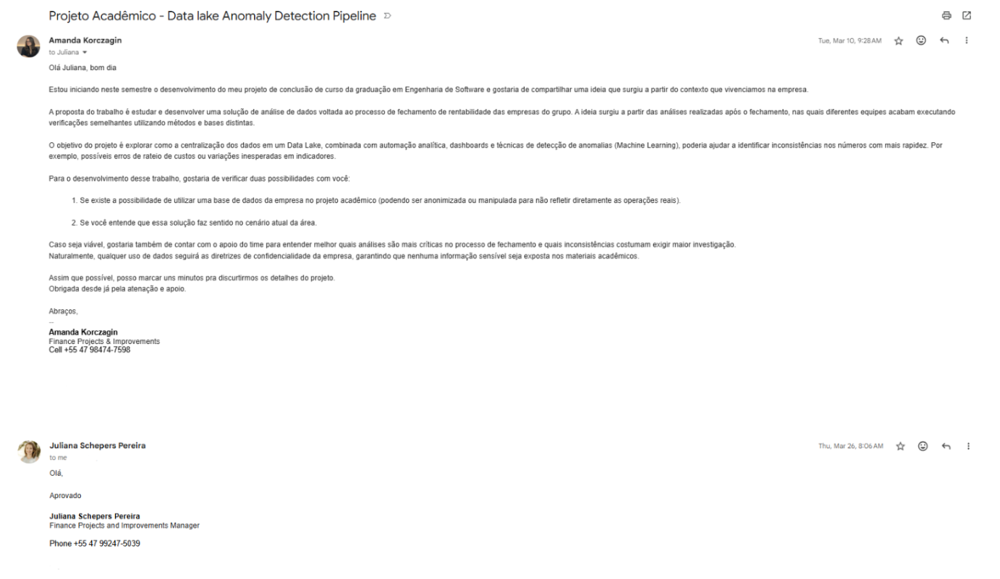
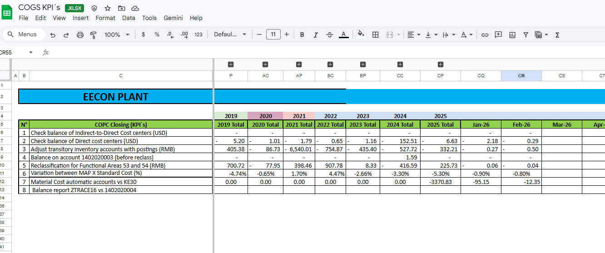
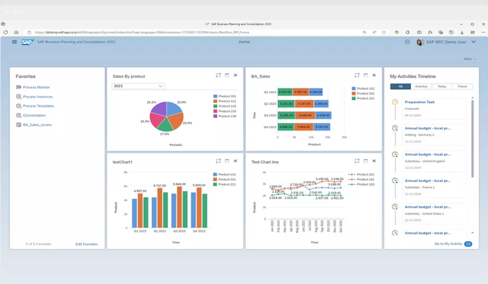
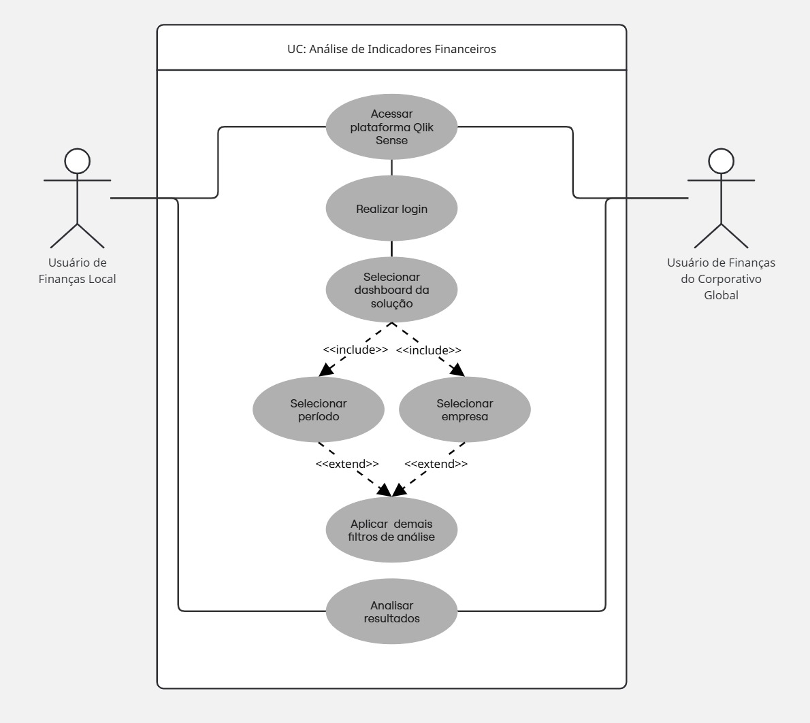
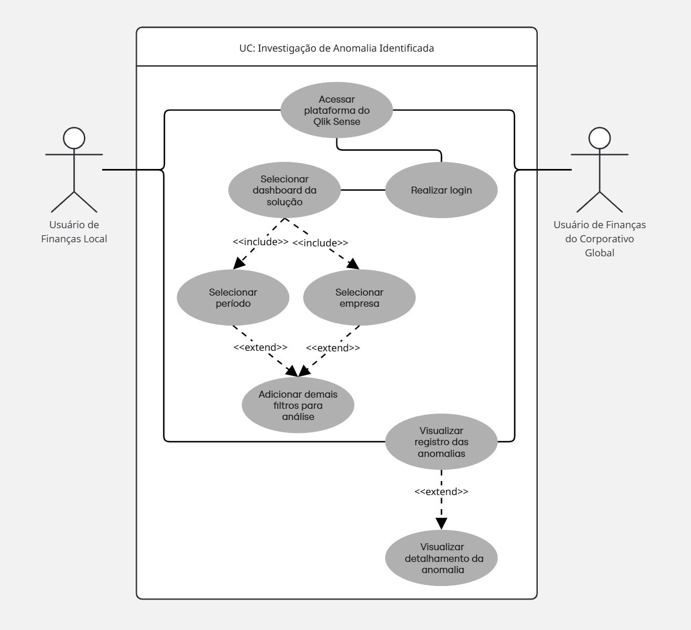
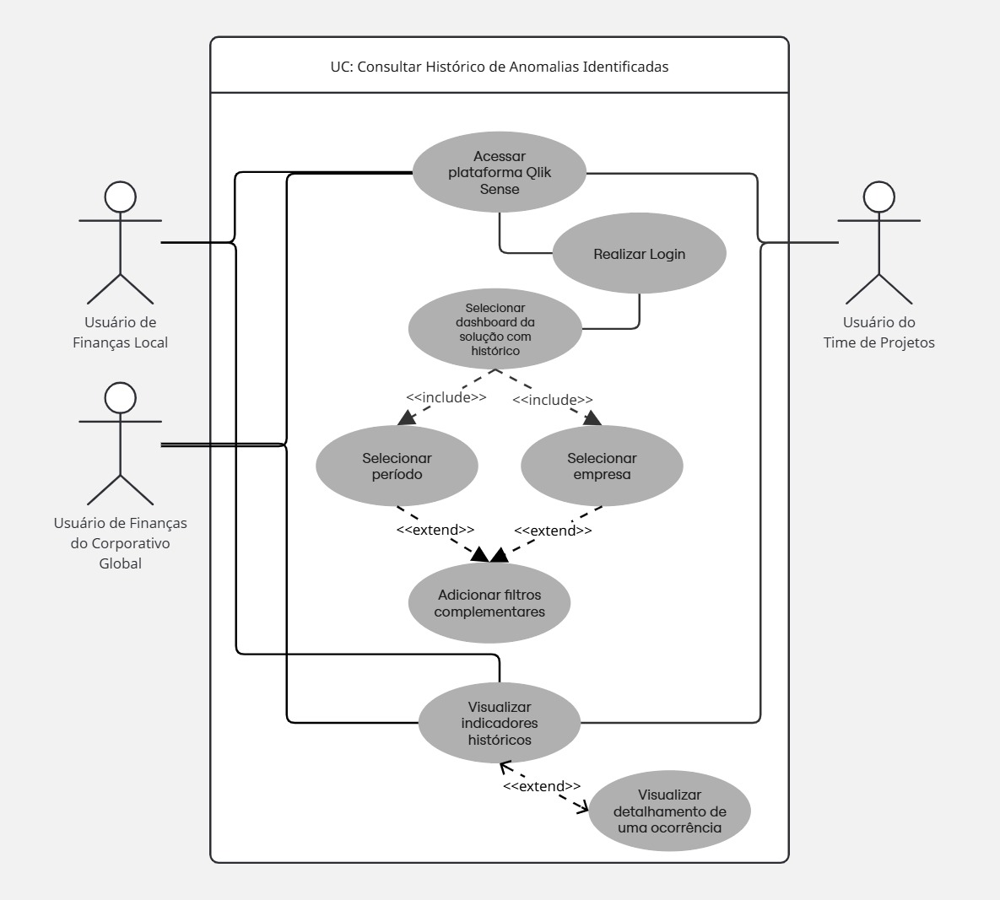
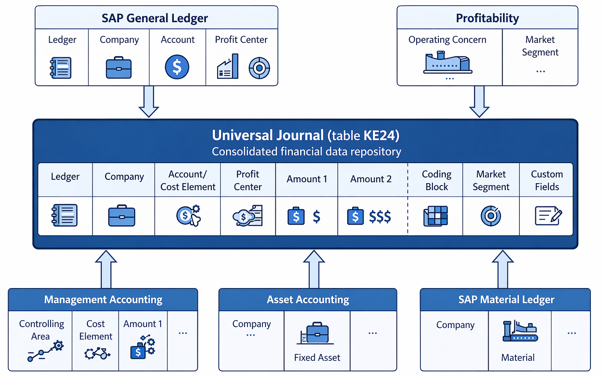
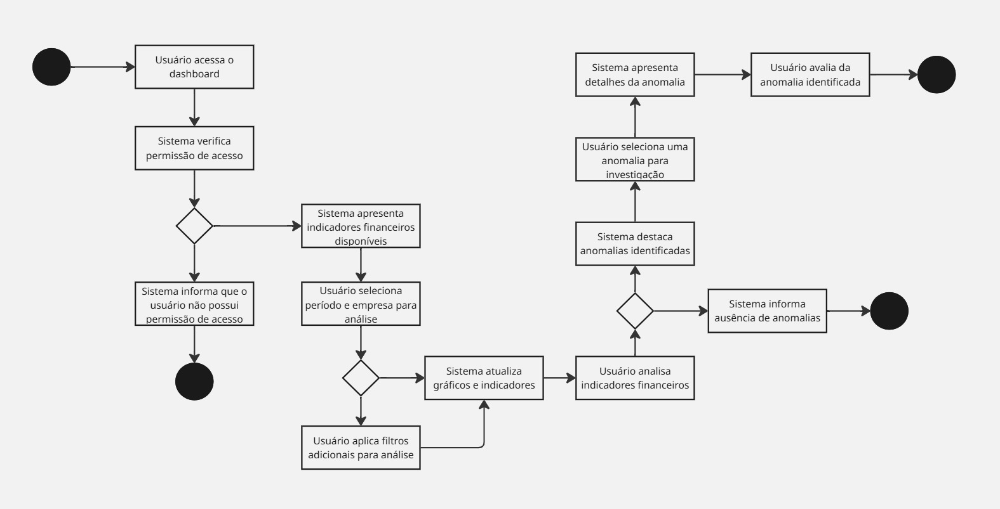
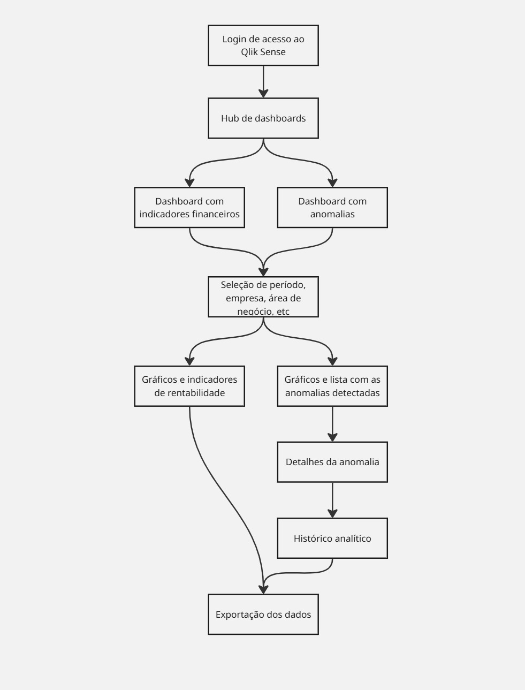

# RFC: Request for Comments - Projeto de Portifólio

## Identificação 
- **Título do Projeto:** Data Lake Anomaly Detection Pipeline  
- **Linha do Projeto:** Dados e IA (Machine Learning)  
- **Autor:** Amanda Korczagin  
- **Data da proposta:**  24/05/2026
- **Versão:** 2.2  

---

## 1. Visão de produto e impactos (O Problema)

### 1.1. Contexto e problema 

Em organizações que possuem múltiplas unidades de negócio ou empresas pertencentes a um mesmo grupo econômico, o processo de consolidação e análise de informações financeiras representa uma etapa crítica para a gestão corporativa, pois fornece suporte à tomada de decisão estratégica e ao controle gerencial (LAUDON, 2020). Após o fechamento contábil mensal, as equipes da área financeira realizam análises para validar os números consolidados, identificar possíveis inconsistências e garantir que os resultados divulgados reflitam corretamente a realidade operacional das empresas do grupo.  

Nesse contexto, as atividades relacionadas à validação dos resultados financeiros são realizadas pelos mais variados times de finanças, que frequentemente executam verificações semelhantes utilizando métodos, consultas e bases de dados distintas para chegar às mesmas conclusões. Atualmente, essas análises são realizadas por meio da extração de dados do sistema ERP, utilização de planilhas eletrônicas e validações visuais. Embora esses procedimentos tenham sido mantidos nos últimos anos como parte da rotina organizacional, eles apresentam forte dependência de atividades manuais e pouca padronização nas análises realizadas pelos diferentes times. 

Essa diversidade de origem e formato de dados aumenta o esforço operacional, possibilita o surgimento de divergências na interpretação dos dados e torna a análise mais complexa diante do grande volume de informações envolvidas, elevando também o risco de atrasos na identificação de inconsistências de caráter crítico. 

A validação da Margem de Contribuição é um dos pontos mais relevantes deste processo, por sua importância na análise de rentabilidade do grupo. Por evidenciar a capacidade de cada operação de cobrir custos fixos e gerar lucro (HORNGREN et al., 2012), este indicador exige precisão. Além disso, sob a perspectiva de dados, sua complexidade é elevada, uma vez que seu cálculo demanda a consolidação de um grande volume de transações operacionais provenientes de diferentes módulos do sistema ERP, envolvendo a correta classificação, agregação e associação entre receitas e custos variáveis ao longo do período analisado. 

O desafio reside no fato de que inconsistências em nível granular, como custos atípicos ou rateios incorretos, tendem a ser mascaradas na composição dos dados gerenciais, fazendo com que anomalias passem despercebidas até que sejam evidenciadas por análises manuais detalhadas. A identificação tardia desses erros interrompe o fluxo de fechamento de rentabilidade, exigindo o rastreamento manual entre milhões de registros e o reprocessamento das análises e relatórios contábeis, o que gera um retrabalho significativo e compromete o prazo de liberação dos resultados financeiros do grupo. 

Diante desse cenário, surge a necessidade de centralizar os dados transacionais em uma base de dados integrada e de automatizar a auditoria dos principais indicadores. A consolidação das informações em um data lake permite armazenar grandes volumes de receitas e custos variáveis de forma estruturada e escalável, viabilizando análises mais rápidas e consistentes (KIMBALL; ROSS, 2013). Além disso, a aplicação da Análise Exploratória de Dados (AED) torna-se fundamental para compreender a distribuição das variáveis financeiras, identificar padrões sazonais e tratar de inconsistências prévias. Essa etapa, somada ao desenvolvimento de dashboards gerenciais e algoritmos de machine learning viabiliza a identificação precisa de anomalias e padrões atípicos, apoiando a tomada de decisão baseada em dados estrategicamente tratados (DAVENPORT, 2014).  

Assim, neste projeto é proposto o desenvolvimento de um pipeline de dados em nuvem voltado ao monitoramento da margem de contribuição, com o objetivo de reunir em um único ecossistema as bases financeiras da organização e utilizar técnicas aplicadas de inteligência artificial para automatizar a detecção de anomalias, aumentando a precisão, agilidade e a confiabilidade do processo e das informações no fechamento financeiro do grupo. 

## 1.2. Origem da demanda e evidências 

A origem da demanda deste projeto está diretamente ligada ao contexto organizacional de uma empresa manufatureira multinacional do setor industrial, com atuação global e sede em Joinville/SC. Em um levantamento inicial, foi realizada uma reunião com os principais focal points das equipes envolvidas no fechamento contábil, com o objetivo de identificar e compreender os desafios mais críticos enfrentados ao longo das etapas de execução, conclusão e análise desse ciclo. 

Após uma discussão inicial conjunta, foram conduzidas interações individuais com as áreas de negócio, nas quais foi possível coletar percepções atuais mais precisas e detalhar as principais dificuldades técnicas enfrentadas pelos times, bem como os impactos negativos no andamento das atividades. 

Diante da coleta dessas informações, e após uma rodada extensa e complementar de pesquisa, foi possível concluir que o desenvolvimento de uma solução baseada na centralização de dados e automação analítica permitirá facilitar o apoio à identificação de inconsistências nos dados financeiros de forma mais eficiente. A iniciativa foi submetida à validação da área responsável pela disponibilização de recursos para execução de projetos, a qual demonstrou concordância quanto à relevância da proposta e a viabilidade de desenvolvimento em contexto acadêmico, conforme formalizado na Figura 1.

**Figura 1** – Evidência da validação da proposta por meio de comunicação formal com a área responsável pela gestão de projetos financeiros.

**Fonte**: Gmail corporativo fornecido organização

### 1.2.1. Conformidade à políticas internas da organização. 

Durante o alinhamento com a área de gestão de projetos, também foi ressaltada a necessidade de garantir a confidencialidade das informações financeiras utilizadas na elaboração de relatório e desenvolvimento prático da solução proposta. 

Nesse contexto, o projeto foi estruturado de modo a não expor registros confidenciais, assegurando que os materiais acadêmicos não contenham informações que possam comprometer a integridade ou a privacidade dos dados corporativos, mantendo a conformidade com as políticas internas da empresa. 

## 1.3. Análise de Soluções Existentes (_Benchmark_)

### 1.3.1. Apresentação das Ferramentas

Para validar a viabilidade e a necessidade do desenvolvimento do pipeline de dados customizado, foram analisadas as principais alternativas tecnológicas e metodológicas disponíveis atualmente para o processo de fechamento e detecção de inconsistências:

### 1.3.1.1. Ferramentas de planilhas eletrônicas

**Nome da solução**: Microsoft Excel / Google Sheets  
**Link**: https://www.microsoft.com/excel e https://www.google.com/sheets  
**Público-alvo**: Analistas financeiros, contadores, entre outros.  
**Principais funcionalidades**:
 - Manipulação de dados;
 - Aplicação de fórmulas e demais cálculos financeiros;
 - Tabelas dinâmicas;
 - Gráficos e relatórios;
 - Macros para automação.

As planilhas eletrônicas representam uma das ferramentas mais utilizadas pelas equipes financeiras, sendo empregadas para validações por meio de fórmulas, tabelas dinâmicas e macros após a extração de dados dos sistemas ERP (Figura 2). Entretanto, a principal limitação dessa abordagem está na escalabilidade, pois essas ferramentas possuem limite de linhas, carregamento demorado na aplicação da maioria das funcionalidades oferecidas, entre outros impeditivos, os quais evidenciam tamanhas adversidades na análise de grandes volumes de dados. 

Além disso, o processo depende de validações manuais e da percepção humana para identificação de inconsistências, não possuindo recursos de detecção automática de anomalias ou geração de alertas. Dessa forma, embora amplamente utilizadas, planilhas eletrônicas não foram projetadas para análise de grandes volumes de dados, cenário em que plataformas de _Big Data_ se tornam mais adequadas (TURBAN, et al., 2011; DAVENPORT, 2014).

**Figura 2** – Planilha de controle financeiro e acompanhamento de KPIs (dados anonimizados)

**Fonte**: Elaborada pela gerente do time de custos do Global Business Support (GBS) em 2019 com base em dados internos da empresa. 

### 1.3.1.2.  Ferramentas de _Business Inteligente_ (BI)

**Nome da solução**: Microsoft Excel / Google Sheets  
**Link**: https://powerbi.microsoft.com  
**Público-alvo**: Analistas de dados, gestores e analistas financeiros.  
**Principais funcionalidades**:
 - Criação de dashboards;
 - Visualização de indicadores;
 - Conexão com banco de dados externo;
 - Análise interativa;
 - Relatórios gerenciais.

Ferramentas de _Business Intelligence_ (BI) são utilizadas para visualização de indicadores e construção de _dashboards_ gerenciais, permitindo a análise interativa de dados financeiros. No entanto, quando utilizada como ferramenta principal de validação e processamento de grandes volumes de dados, podem apresentar limitações de desempenho devido ao tempo de recarga e processamento das bases. 

Além disso, ferramentas de BI são voltadas principalmente para análise descritiva e visualização de dados, possuindo limitações para execução de algorítmos estatísticos avançados e geração de alertas proativos de inconsistências. Nesse contexto, técnicas de _Data Science_ e _Machine Learning_ tornam-se mais adequadas para identificar padrões ocultos e previsão de comportamentos futuros com base em grandes volumes de dados (PROVOST; FAWCETT, 2016).

### 1.3.1.3.  Plataformas de CPM (Corporate Performance Management) 

**Nome da solução**: SAP BPC (Business Planning and Consolidation)  
**Link**: https://www.sap.com/products/data-cloud/bpc.html  
**Público-alvo**: Empresas com ERP SAP, áreas de controladoria, contabilidade e planejamento financeiro.    
**Principais funcionalidades**:
 - Consolidação financeira;
 - Planejamento e orçamento;
 - Validações contábeis;
 - Controle de consistência financeira;
 - Relatórios corporativos.

O SAP BPC (_Business Planning and Consolidation_) é utilizado como ferramenta oficial de consolidação financeira e planejamento, sendo responsável por garantir a consistência contábil e a integridade das informações por meio da exposição de _dashboards_ (Figura 3) e validações determinísticas. Como exemplo, destacam-se as regras de partidas dobradas, princípio contábil no qual toda transação deve possuir um débito e um crédito do mesmo valor, garantindo o equilíbrio das demonstrações financeiras. 

Apesar de sua robustez, a plataforma apresenta limitações em relação  à problemática abordada neste projeto, principalmente pela ausência de mecanismos de análise estatística, aprendizado com dados históricos e detecção automática de anomalias. Na prática, desde que atendam às regras contábeis, lançamentos ou rateios com comportamentos atípicos podem ser considerados válidos pelo sistema (PADOVEZE, 2010). Dessa forma, embora a ferramenta atenda de forma eficiente aos requisitos contábeis e de consolidação financeira, não contempla funcionalidades necessárias para a identificação de comportamentos atípicos, inconsistências operacionais ou possíveis falhas no tratamento de dados. 

**Figura 3** – Interface de _dashboard_ e acompanhamento de tarefas do SAP _Business Planning and Consolidation_ (BPC) Software

  

**Fonte**: SAP BPC (2026), disponível em: https://www.sap.com/products/data-cloud/bpc.html.

### 1.3.2. Comparação das ferramentas

Os pontos fortes e limitações das soluções apresentadas na pesquisa de benchmark podem ser resumidas como exposto na seguinte tabela:

| Solução                 | Pontos Fortes                 | Limitações                   |
|-------------------------|-------------------------------|------------------------------|
| **Excel & Google Sheets**| Fácil de usar, amplamente utilizado, compatível com diversas outras ferramentas.| Não escalável, manual, sem configurações para geração de alertas automáticos, limite de linhas restringe a quantidade de dados permitida nas análises.|
| **Ferramentas de _Business Intelligence_ (BI)** | Ótima visualização, _dashboards_ interativos.| Não é ideal para processamento pesado e detecção de anomalias.|
| **SAP BPC**| Consolidação financeira robusta, validações contábeis.| Não possui inteligência estatística, difícil de criar novas validações.     |
| **Projeto de portfólio**| Configuração para detecção automática de anomalias, escalável, integração de dados. | Não deve ser utilizado como ferramenta de consolidação financeira.|

### 1.3.3. Diferencial da solução

O diferencial esperado para o projeto proposto está na utilização de uma arquitetura baseada em Data Lake e algoritmos de Machine Learning para detecção automática de anomalias em dados financeiros. Diferente das soluções tradicionais, que dependem de validações manuais, regras fixas e análises visuais, a solução proposta permitirá identificação de padrões atípicos de forma automatizada e escalável, buscando possibilitar a detecção proativa de inconsistências antes de qualquer impacto no processo de fechamento financeiro.

Além disso, a solução não é idealizada para substituir o uso dos sistemas existentes mencionados na pesquisa de benchmark, mas para atuação complementar, integrando dados de diferentes formas e disponibilizando análises avançadas para as equipes de planejamento da organização. 

## 1.4 Público-Alvo

O público-alvo desse projeto é composto por profissionais das áreas financeiras responsáveis pela análise, validação e consolidação dos resultados das empresas do grupo. Esses profissionais atuam tanto em times locais, ligados diretamente às unidades de negócio ou regiões específicas, quanto em equipes do corporativo global, responsáveis pela e acompanhamento dos indicadores financeiros em nível estratégico. 

Entre as áreas diretamente envolvidas nesse processo estão as equipes de FP&A (_Financial Planning & Analysis_), controladoria, custos, contabilidade, planejamento e orçamento, projetos de finanças, _commercial finance_, tesouraria, _taxes_, entre outros. Essas equipes utilizarão os dados financeiros disponibilizados pelo sistema para validar indicadores de desempenho, investigar variações nos resultados e garantir a consistência das informações utilizadas na tomada de decisão. 

A interação desse público com o sistema ocorrerá principalmente durante os períodos de fechamento financeiro, momento em que os times realizam verificações adicionais para confirmar a consistência dos números consolidados e investigar possíveis variações relevantes nos resultados. Logo, do ponto de vista técnico, espera-se que os usuários possuam conhecimento intermediário sobre dados financeiros e indicadores de rentabilidade, mas sem a necessidade de experiência avançada em tecnologia ou ciência de dados. 

Dessa forma, a atuação desses profissionais se dará por meio da interpretação visual dos dashboards analíticos e alertas automatizados, possibilitando que os usuários traduzam rapidamente os comportamentos atípicos detectados em ações de correção. 

## 1.5. Objetivos do Projeto

### 1.5.1. Objetivos Gerais

Desenvolver uma solução tecnológica automatizada, baseada na arquitetura de Data Lake e modelos de Machine Learning, para a detecção preditiva de anomalias em dados financeiros transacionais focados na Margem de Contribuição. A solução busca aumentar a confiabilidade das informações financeiras, reduzir o retrabalho operacional e otimizar o tempo de validação das equipes durante o processo de fechamento contábil e gerencial. 

### 1.5.2. Objetivos Específicos

 - Centralizar e estruturar dados transacionais de receitas e custos variáveis em um ambiente escalável de _Data Lake_ na nuvem.

 - Implementar mecanismos de detecção de anomalias na Margem de Contribuição utilizando modelos de _Machine Learning_ desenvolvidos em Python. 

 - Desenvolver um sistema de alertas automatizado capaz de notificar os focal points das equipes financeiras quando forem identificadas anomalias estatísticas relevantes nos dados analisados.

 - Disponibilizar um dashboard analítico que permita a exploração visual das inconsistências e facilite a investigação das causas dos desvios.

 - Projetar uma arquitetura de dados escalável, utilizando ferramentas e frameworks compatíveis com o ambiente tecnológico da organização.

Com isso, o projeto busca transformar um processo atualmente manual e descentralizado em um processo estruturado, automatizado e orientado a dados, permitindo que as equipes financeiras atuem de forma mais preventiva na identificação de inconsistências, reduzindo riscos e aumentando a confiabilidade das informações utilizadas na tomada de decisão. 

## 1.6 Métricas de Sucesso (KPIs)

O projeto será avaliado por meio de indicadores que medem tanto o desempenho técnico da solução quanto o impacto nas análises financeiras. Os principais indicadores definidos são:

 - **Redução de tempo de identificação de inconsistências**  
  Reduzir em pelo menos 50% o tempo médio necessário para identificar inconsistências na Margem de Contribuição, em comparação com o processo atual, contribuindo para maior agilidade no processo de fechamento financeiro.

 - **Precisão do modelo na detecção de anomalias**  
  Atingir uma taxa mínima de 75% de precisão na identificação de comportamentos anômalos relevantes nos dados financeiros analisados, assegurando maior confiabilidade nos resultados gerados pelo modelo.

 - **Otimização do tempo de processamento do _pipeline_ de dados**   
  Garantir que os dados sejam processados e disponibilizados para análise em até 15 minutos após sua ingestão no data lake, assegurando agilidade na disponibilização das informações.

 - **Tempo de geração de alertas automáticos**  
  Garantir que alertas automáticos sejam emitidos em até 5 minutos após a identificação de possíveis inconsistências, viabilizando uma atuação proativa na identificação e tratamento de inconsistências.

 - **Sensibilidade (recall) do modelo de detecção de anomalias**  
  Garantir que pelo menos 80% das inconsistências reais sejam identificadas, reduzindo o risco de erros financeiros não detectados durante o processo de fechamento.

 Esses indicadores permitem avaliar não apenas o desempenho técnico da solução, mas também o seu impacto direto na eficiência do processo de fechamento financeiro e na confiabilidade das informações utilizadas pela organização.

# 2. Engenharia de Requisitos 
## 2.1. Personas

Para garantir que a solução proposta atenda às necessidades reais dos usuários envolvidos no processo de fechamento e análise financeira, foram definidas três personas representando os principais perfis de usuários impactados pelo sistema:

### 2.2.1. Responsável por atividades de fechamento

Martin Kovak, especialista no time corporativo global de custos do GBS (Global Business Support) da Eslováquia.

Martin é responsável pelo processo de fechamento financeiro mensal de uma das unidades do grupo. Durante o fechamento, ele precisa garantir que todas as receitas, custos fixos e variáveis, e rateios de rentabilidade estejam corretamente refletidos no sistema antes do envio das informações para consolidação corporativa. Ele trabalha com extrações de dados do ERP e planilhas de Excel, realizando o preenchimento manual de KPIs e suas respectivas análises. 

**Atribuições:**
 - Suportar as plantas da organização nas análises e validações pré e pós fechamento;
 - Execução dos fechamentos, COPC (Product Cost Controlling) e COPA (Controlling Profitability Analysis);
 - Preencher manualmente os KPIs corporativos globais de controle de dados;
 - Garantir a execução das atividades sem inconsistências.

**Principais dificuldades:**
 - Grande volume de dados para validar manualmente;
 - Dependência de planilhas e análises manuais;
 - Dificuldade em identificar pequenos erros em meio a milhões de registros;
 - Pressão com prazos de execução do fechamento.

Para a correta compreensão das rotinas de auditoria e validação da Margem de Contribuição, é necessário pontuar a diferença entre as duas principais etapas de fechamento no sistema SAP, o COPC (Product Cost Controlling) e o COPA (Controlling Profitability Analysis).

O COPC atua na preparação operacional do sistema, consolidando o custo real dos produtos por meio do encerramento de ordens de produção, ajustes contábeis gerenciais e a execução de jobs que atualizam o Preço Médio Ponderado (MAP) de todos os produtos (DUNCAN, 2014). Com essa base estruturada, o próximo passo é o COPA, assumindo então um foco mais estratégico.

Nessa fase, ocorre o cruzamento estratégico entre custos e receitas, que são distribuídos detalhadamente por cliente, código de material e origem. Ao realizar esse rateio em diferentes dimensões do negócio, a Margem de Contribuição é consolidada com a granularidade ideal para ser integrada à solução proposta. 

### 2.2.2. Analista de Finanças

Fernanda Martins, analista de FP&A (Financial Planning & Analysis) no time corporativo global de finanças.

Fernanda é responsável por analisar os resultados financeiros após o fechamento mensal, avaliando variações de receita, custos e margem de contribuição. Seu trabalho consiste em identificar e explicar desvios em relação ao orçamento, forecast e períodos anteriores, garantindo que os resultados apresentados à diretoria reflitam corretamente a situação financeira da empresa. Para isso, ela utiliza relatórios extraídos do SAP, dashboards em ferramentas de BI e planilhas de Excel para análises complementares e investigações de variações, além de ferramentas como o BW, também nativo do SAP.

**Atribuições:**
 - Analisar variações dos resultados financeiros após o fechamento;
 - Identificar e explicar possíveis variações relevantes;
 - Garantir a confiabilidade dos números apresentados à diretoria;
 - Produzir relatórios gerenciais e apresentações executivas.

**Principais dificuldades:**
 - Processo de investigação de inconsistências após a conclusão do fechamento é lento e manual;
 - Necessidade de cruzar dados de diferentes sistemas e planilhas;
 - Dependência de análises visuais para identificar possíveis anomalias dos dados;
 - Grande volume de informações para analisar em um curto período de tempo.

### 2.2.3. Especialista de Projetos de Finanças

Nancy Williams, especialista no time corporativo global de projetos de finanças. 

Nancy atua na área corporativa responsável pela manutenção e evolução dos sistemas financeiros utilizados pela organização, como SAP, SAP BPC, ferramentas de Business Intelligence e automações em planilhas e scripts. Seu trabalho envolve propor melhorias, automatizar processos, padronizar fluxos financeiros em nível global e garantir que as soluções atendam às legislações locais de cada país. Ela também participa de projetos de implementação de SAP em empresas recém adquiridas pelo grupo, garantindo a integração dos dados e a padronização dos processos financeiros. 

**Atribuições:**
 - Padronizar atividades financeiras em nível global;
 - Automatizar processos manuais relacionados ao fechamento e análises de resultado;
 - Integrar dados de diferentes sistemas financeiros;
 - Garantir conformidade com legislações locais de todas as plantas;
 - Melhorar a disponibilidade e confiabilidade dos dados para análise.

**Principais dificuldades:**
- Integração complexa entre diferentes sistemas e bases de dados;
 - Necessidade constante de desenvolver novas automações para atender demandas do negócio;
 - Limitações das ferramentas atuais para análises mais avançadas e monitoramento automático de inconsistências.

As personas indicadas representam os principais perfis envolvidos no processo de fechamento e análise financeira dentro da organização, abrangendo respectivamente atividades operacionais, analíticas e estratégicas. Apesar de atuarem em etapas distintas do processo, todas enfrentam dificuldades relacionadas ao grande volume de dados, à dependência de controles manuais e à dificuldade de identificação de inconsistências. 

Além desses perfis, a solução proposta também apoiará equipes locais de finanças, que utilizam os dados para compreender com maior precisão o cenário contábil de suas respectivas unidades, analisar oscilações de desempenho e apoiar decisões relacionadas a critérios de rateio aplicados em processos como o COPA. Dessa forma, amplia-se o alcance da proposta, que passa a atender não apenas demandas corporativas globais, mas também necessidades analíticas e gerenciais em nível local. 

Nesse contexto, com o objetivo de centralizar os dados, padronizar as análises e permitir a identificação proativa de anomalias no tratamento das bases informacionais, o projeto contribuirá para a redução de retrabalho e o aumento da confiabilidade das informações no suporte à tomada de decisão gerencial. 

## 2.2. Casos de Uso Principais

### 2.2.1. Análise de Indicadores Financeiros 

**Atores:** 
 - Usuário de Finanças Local
 - Usuário de Finanças Corporativo Global

**Fluxo Principal:**
 1. O usuário acessa a plataforma web do Qlik Sense.
 2. O usuário fornece as informações necessárias para o login, com o email da organização e a senha cadastrada na criação da conta.
 3. O usuário seleciona o dashboard analítico da solução.
 4. O sistema apresenta os indicadores financeiros disponíveis.
 5. O usuário seleciona nos campos de filtro o período e empresa a serem analisados.
 6. O usuário pode selecionar outros filtros relevantes de acordo com a necessidade para cada análise, como produto, centro de custo, cliente, entre outros.
 7. O sistema atualiza a visualização conforme os critérios selecionados .
 8. O usuário analisa os indicadores e gráficos apresentados.

**Fluxo Alternativo:**

 2.a. Credenciais inválidas.  
 2.a.1. O sistema informa que não foi possível realizar o login com as credenciais fornecidas.  
 2.a.2. O fluxo é encerrado.

 7.a. Não existem dados para os filtros selecionados  
 7.a.1. O sistema informa que não há dados disponíveis para os critérios escolhidos.  
 7.a.2. O fluxo retorna ao passo 4.

**Figura 4** – Diagrama de Caso de Uso - Análise de Indicadores Financeiros

  

**Fonte**: Elaborado pela autora, com auxílio da ferramenta Miro (2026).

### 2.2.2. Investigação de Anomalia Identificada

**Atores:** 
 - Usuário de Finanças Local
 - Usuário de Finanças Corporativo Global

**Fluxo Principal:**
 1. O usuário acessa a plataforma web do Qlik Sense.
 2. O usuário fornece as informações necessárias para o login, com o email da organização e a senha cadastrada na criação da conta.
 3. O usuário seleciona o dashboard analítico da solução.
 4. O sistema apresenta os registros gerais das anomalias identificadas.
 5. O usuário seleciona nos campos de filtro o período e a empresa a serem analisados.
 6. O usuário pode selecionar filtros adicionais de investigação, como nível de risco, indicador, unidade de negócio, entre outros.
 7. O sistema atualiza a listagem de anomalias conforme os critérios selecionados.
 8. O usuário seleciona uma anomalia específica para análise detalhada.
 9. O sistema apresenta as informações de ocorrência, incluindo o indicador afetado, classificação de risco, dimensões relacionadas, data de detecção e dados de apoio à identificação.
 10. O usuário analisa a ocorrência para apoiar a identificação da possível causa da inconsistência.

**Fluxo Alternativo:**  
 2.a. Credenciais inválidas.  
 2.a.1. O sistema informa que não foi possível realizar o login com as credenciais fornecidas.  
 2.a.2. O fluxo é encerrado.

 7.a. Não existem anomalias para o filtro selecionado.   
 7.a.1. O sistema informa que não há anomalias para os critérios escolhidos.  
 7.a.2. O fluxo retorna para o passo 5. 

 9.a. O detalhamento da anomalia está inconclusivo.  
 9.a.1. O sistema informa que a ocorrência foi identificada, mas que o detalhamento ainda está em processamento/indisponível.   
 9.a.2 O fluxo retorna para o passo 8. 
 

**Figura 5** – Diagrama de Caso de Uso - Investigação de Anomalia Identificada

  

**Fonte**: Elaborado pela autora, com auxílio da ferramenta Miro (2026).

### 2.2.3. Consultar Histórico de Ocorrências 

**Atores:** 
 - Usuário de Finanças Local
 - Usuário de Finanças Corporativo Global
 - Usuário de Projetos de Finanças 

**Fluxo Principal:**
 1. O usuário acessa a plataforma web do Qlik Sense.
 2. O usuário fornece as informações necessárias para o login, com o email da organização e a senha cadastrada na criação da conta.
 3. O usuário seleciona o dashboard de histórico das anomalias identificadas pela solução.
 4. O sistema apresenta a versão consolidada do histórico de ocorrências registradas.
 5. O usuário seleciona os filtros desejados para consulta, como período, empresa, status da ocorrência, nível de risco, indicador, entre outros indicadores relevantes.
 6. O sistema atualiza a visualização de acordo com os critérios selecionados.
 7. O usuário visualiza indicadores históricos de ocorrências, como quantidade de anomalias, status, recorrência e distribuição por nível de risco.
 8. O usuário analisa o histórico das ocorrências por meio de tabelas, gráficos, KPIs e demais indicadores consolidados.
 9. O usuário pode selecionar uma ocorrência específica para visualizar seu detalhamento.
 10. O sistema apresenta as informações detalhadas da ocorrência selecionada, incluindo status, data de identificação, classificação de risco e outras atualizações registradas.
 11. O usuário utiliza as informações apresentadas para acompanhar o histórico das ocorrências e apoiar as análises de desempenho do processo. 

**Fluxo Alternativo:**  
 2.a. Credenciais inválidas.  
 2.a.1. O sistema informa que não foi possível realizar o login com as credenciais fornecidas.  
 2.a.2. O fluxo é encerrado

 6.a. Não existem ocorrências registradas para os filtros selecionados.  
 6.a.1. O sistema informa que não há histórico disponível para os critérios selecionados.  
 6.a.2. O fluxo retorna ao passo 3.

 10.a. O detalhamento da anomalia está indisponível.  
 10.a.1. O sistema informa que o detalhamento da anomalia está indisponível.  
 10.a.2. O fluxo retorna para o passo 9.

**Figura 6** – Diagrama de Caso de Uso - Consultar Histórico de Anomalias Identificadas

  

**Fonte**: Elaborado pela autora, com auxílio da ferramenta Miro (2026).

## 2.3. Requisitos Funciohnais 

Os requisitos funcionais descrevem as funcionalidades que o sistema deve executar, sejam elas ações, serviços ou operações que a solução deva ser capaz de realizar para atender às necessidades dos usuários identificados nas personas e nos casos de uso apresentados anteriormente. No contexto do presente trabalho, esses requisitos estão relacionados à integração e processamento de dados financeiros, detecção de anomalias, geração de alertas e disponibilização das informações para a análise por meio de dashboards e relatórios.

RF01 - O sistema deve integrar dados de diferentes fontes  
RF02 - O sistema deve processar dados financeiros  
RF03 - O sistema deve ser capaz de detectar anomalias na base de dados  
RF04 - O sistema deve gerar alertas automáticos  
RF05 - O sistema deve disponibilizar dashboards  
RF06 - O sistema deve permitir análises detalhadas  
RF07 - O sistema deve permitir a geração de relatórios  
RF08 - O sistema deve permitir a configuração de parâmetros para análise dos dados  
RF09 - O sistema deve armazenar o histórico das análises  
RF10 - O sistema deve permitir consultas por período, empresa, conta contábil, centro de custo, etc.   
RF11 - O sistema deve permitir conferência das análises realizadas e anomalias identificadas.

## 2.4. Requisitos Não Funcionais 

Além dos requisitos funcionais, o sistema deve atender a requisitos não funcionais, que representam características de qualidade da solução, como desempenho, segurança, confiabilidade, escalabilidade e usabilidade. Esses requisitos descrevem a forma como o sistema deve operar, garantindo que a solução seja eficiente, segura e adequada ao ambiente corporativo no qual será utilizada. 

RNF01 - O sistema deve processar os dados em até ? minutos após sua disponibilização do Data Lake.  
RNF02 - O sistema deve permanecer acessível e operacional durante a janela oficial de fechamento financeiro mensal da organização, assegurando a consulta aos dashboards, alertas gerados e histórico analítico sem interrupções planejadas nesse período.  
RNF03 - Manutenções programadas ou atualizações da solução devem ocorrer fora da janela oficial de fechamento financeiro, exceto em situações emergenciais.  
RNF04 - O sistema deve permitir acesso apenas a usuários autorizados.  
RNF05 - O sistema deve suportar o upload de milhões de registros.  
RNF06 - O sistema deve ser escalável em ambiente de nuvem, permitindo aumento da capaciade de processamento conforme a demanda (elasticidade).   
RNF07 - O sistema deve possuir uma interface de visualização fácil e intuitiva.  
RNF08 - O sistema deve registrar logs de processamento.

## 2.5. Regras de Negócio 

As regras de negócio definem  as condições, restrições e validações que devem ser observadas pelo sistema, a fim de garantir que os processos e as análises financeiras sejam executados em conformidade com as práticas e diretrizes da organização. No contexto deste projeto, tais regras não se limitam apenas ao tratamento analítico das informações, uma vez que é necessário considerar também a complexidade do ambiente em que esses dados são gerados e consolidados. 

Em organizações que utilizam o SAP como sistema corporativo de controle de recursos, as informações financeiras e gerenciais são originadas em diferentes módulos, que mantêm relações de dependência entre si e complementam estruturas integradas de registro e análise. Essa característica exige que a solução considere não apenas a origem oficial das bases informacionais, mas também a consistência, a rastreabilidade e a coerência entre os dados provenientes de diferentes contextos sistêmicos, como representado no fluxo ilustrado na Figura 7.

**Figura 7** – Diagrama para representação das conexões entre diferentes módulos do SAP.

  

**Fonte**: Prime Institute (2024), disponível em: https://www.primeinstitute.com/preguntas/analise-de-rentabilidade-no-sap-copa-copa-baseada-em-custos-copa-baseada-em-contas-e-analise-de-margem-4311

Considerando esse contexto de integração e dependência entre módulos, as principais regras de negócio estão relacionadas aos seguintes controles:

**Regras de integração de dados:**
 - A consolidação de informações financeiras provenientes de diferentes módulos devem respeitar diferenças de estrutura, granularidade e contexto de negócio, garantindo que os indicadores calculados reflitam corretamente a realidade analisada.
 - Apenas bases oficiais e validadas pela organização devem ser utilizadas no processamento analítico da solução.
 - Os dados integrados devem preservar sua origem e rastreabilidade ao longo das etapas de carga, tratamento e análise.

**Regras de acesso:**
 - Apenas usuários autorizados podem acessar o sistema.
 - O usuário deve visualizar apenas os dados das empresas às quais possui permissão de acesso.
 - Apenas usuários do corporativo global podem alterar os parâmetros do sistema e as regras de detecção de anomalias.

**Regras de detecção de anomalias:**
 - Um alerta de anomalia deve ser gerado quando for identificado um comportamento fora do padrão estatístico definido pelo modelo.
 - O sistema deve permitir a configuração de limites mínimos de variação para geração de alertas.
 - Os alertas devem ser classificados por nível de risco (baixo, médio e alto).

**Regras de indicadores Financeiros:**
 - A margem de contribuição deve ser calculada com base na diferença entre o total da receita líquida e os custos variáveis.
 - O sistema deve permitir a análise dos indicadores por período, empresa, unidade de negócio, produto, centro de custo, entre outros.
 - Os dados analisados devem ser provenientes dos sistemas oficiais da empresa.
 - Alterações nos parâmetros do sistema devem ser registradas com o nome de usuário, data e hora.

**Regras de Processamento:**
 - Os dados financeiros devem ser processados apenas após a carga completa das bases no Data Lake.
 - O sistema deve manter o histórico das análises e dos alertas gerados para futuras avaliações de auditoria.

## 2.6. Fora do Escopo 

A seguir serão apresentadas as funcionalidades e atividades que não fazem parte do escopo da solução proposta. Essa definição é importante para delimitar o objetivo do projeto, evitando o crescimento descontrolado do escopo e garantindo que o foco da solução permaneça na detecção de anomalias e na análise de indicadores financeiros relacionados à margem de contribuição.

 - O sistema proposto não substituirá o ERP (Enterprise Resource Planning) da empresa.
 - O sistema proposto não realizará nenhum lançamento contábil ou ajuste.
 - O sistema proposto não será responsável pela consolidação contábil oficialmente reportada no SAP BPC.
 - O sistema proposto não substituirá o uso das ferramentas de BI utilizadas para análises financeiras por completo.
 - O sistema proposto não realizará nenhuma atividade de fechamento financeiro.
 - O sistema proposto não corrigirá automaticamente nenhum dado financeiro.
 - O sistema proposto não será responsável pelo planejamento orçamentário (budget e forecast).
 - O sistema proposto não terá como objetivo construir um novo sistema contábil independente.
 - O sistema proposto não realizará integração em tempo real com todos os sistemas da empresa.
 - O sistema proposto não tomará nenhuma decisão automática, apenas gerará alertas e análises.

# Fluxos e Comportamentos do Sistema
## 3.1. Fluxo Principal do Usuário 

**Figura 8** – Diagrama de atividade.

  

**Fonte**: Elaborado pela autora, com auxílio da ferramenta Miro (2026).

## 3.2. Fluxos Alternativos 

### 3.2.1. Acesso não autorizado 
O usuário tenta acessar o dashboard, mas não possui permissão de acesso.   
**Comportamento esperado do sistema:** O sistema informa que o usuário não tem permissão de acesso e encerra o fluxo. 

### 3.2.2. Filtros sem dados disponíveis 
O usuário seleciona período, empresa ou demais filtros que não retornam nenhum registro. 
**Comportamento esperado do sistema:** O sistema informa que não há dados disponíveis para os critérios selecionados e permite que o usuário ajuste os filtros.

### 3.2.3. Nenhuma anomalia indentificada
Os indicadores financeiros são carregados, mas o modelo não identifica nenhuma anomalia.
**Comportamento esperado do sistema:** O sistema informa ausência de anomalias e permite que o usuário conclua a análise. 

### 3.2.4. Falha ao carregar detalhes da anomalia
O usuário seleciona a anomalia, mas ocorre falha na consulta dos detalhes.
**Comportamento esperado do sistema:** O sistema exibe uma mensagem de erro que permite retornar ao dashboard principal com a lista de anomalias.

### 3.2.5. Cancelamento da investigação
O usuário decide não prosseguir com a análise detalhada de uma anomalia. 
**Comportamento esperado do sistema:** O sistema permite retornar ao dashboard principal com a lista de anomalias detectadas.

# 4. Mockups e Experiência do Usuário (UX)
## 4.1. Fluxo de Navegação 

O fluxo de navegação apresenta o caminho principal percorrido pelo usuário dentro da solução, desde o acesso ao Qlik Sense até a consulta dos dashboards financeiros de rentabilidade e de detecção das anomalias. A estrutura foi organizada para permitir que o usuário filtre os dados conforme o contexto da análise a ser realizada, acessando de forma direta os indicadores, detalhes das ocorrências, histórico analítico e opções de exportação.

**Figura 9** – Diagrama de Fluxo de Navegação da solução proposta

  

**Fonte**: Elaborado pela autora, com auxílio da ferramenta Miro (2026).

# 3. Fluxos e Comportamentos do Sistema
# 4. Mockups e Experiência do Usuário (UX)
# 5. Arquitetura do Sistema
# 6. Segurança e privacidade
# 7. Planejamento do Projeto 

# 8. Referências 

- LAUDON, Kenneth C.; LAUDON, Jane P. Sistemas de Informação Gerenciais. 16. ed. Pearson, 2020.
- HORNGREN, Charles T. et al. Contabilidade Gerencial. Pearson, 2012.
- KIMBALL, Ralph; ROSS, Margy. Data Warehouse Toolkit. Wiley, 2013.
- DAVENPORT, Thomas H. Big Data at Work. Harvard Business Review Press, 2014.
- PROVOST, Foster; FAWCETT, Tom. Data Science for Business. O’Reilly, 2016.
- PADOVEZE, Clóvis Luís. Controladoria Estratégica e Operacional. Cengage Learning, 2010.
- SAP. SAP Business Planning and Consolidation. Disponível em: https://www.sap.com/products/data-cloud/bpc.html.

# 9. Apêndices
# 10. Parecer do Comitê de Avaliação 

